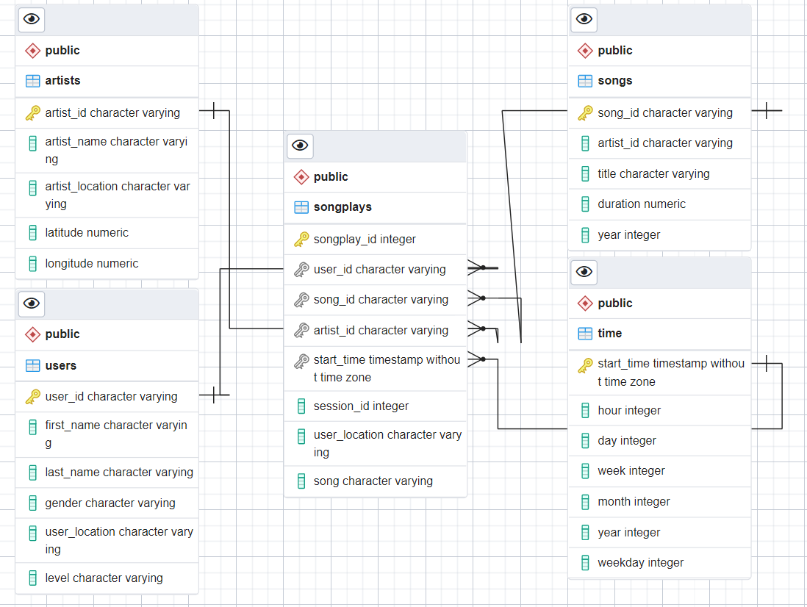

# Data Modeling with PostgreSQL

## Description

The dataset used in this project has been collected from songs and users activities
on a streaming music app. The purpose is to analyze data and understand what
songs users are listening to. Data has been collected in JSON format. Those
`.json` files are located in different directories and doesn't make it easy to
perform data analysis:  

For this reason, I'm going to build an ETL pipeline that will transfer data
from JSON files in those seven directories into a postgres database using python
and SQL. The data will then be ready for data analysis from Sparkify analytics
team (Sparkify is a startup who owns the streaming music app mentionned above). 
But before writting the ETL pipeline, I'm going to define fact and dimension 
tables for a star schema. Then I'm going to build an entity relationship diagram
that represents my data model.

## Data Model

According to the dataset, there are 4 dimension tables and 1 fact table.

### Dimension tables

- **artists table**: gives some info about the owner of the song
- **songs table**: gives some info about the song (title, duration, year, ...)
- **users table**: gives some info about who is listening to the song
- **time table**: gives some info about when the song was listened

### Fact table

- **songplays**: is connected to the 4 dimension tables and gives some info
about what song was listened, the location of the user and the session ID.

> In general, a fact table gives some metrics or measurements which are numbers
> such quantity, length, duration, price, ... But this case, the business need is
> to understand what songs users are listening to.

## Project structure

Here is the project files structure.

**Data-Modeling-Postgres** is the working direction where I'll be working in.
It contains 2 subfolders, `images` which can be ignored (contains all images used
for the README.md). The second subfolder `notebook` is most important because it
contain all files that needed for this project:

- `data`: contains the dataset for this project.
- `sql_queries.py`: python script that does the following SQL queries: 
    * DROP TABLES statements for all tables
    * CREATE TABLES statements for all tables
    * INSERT statements with placeholders to populate all tables
    * query to join songs and artists tables
- `create_tables.py`: python script that does the following: 
    * Connect to the default database studentdb 
    * Drop sparkifydb if it exists
    * Create a new sparkifydb datase
    * Disconnect to student and connect to sparkifydb
    * Create all tables
- `etl.py`: python script that does the following: 
    * Get all files in the dataset
    * Process each file, extract, transform and load data into tables
- `etl.ipynb`: notebook to build ETL processes 
- `test.ipynb`: notebook to test that tables have been created and populated.

### Docker configuration

The following files `Dockerfile`, `docker-compose.yml`, `database.env` and 
`requirements.txt` are used to set up 2 docker containers. The first container
is `postgres_container` that will run the posgres service called **pgdb** and 
the second container is `jupyter_container` that will run jupyter lab service
called **jlab**. All the scripts will be executed inside `jupyter_container` in
which all the dependencies have been installed. The communication between the 2
services **jlab** and **pgdb** is handled by docker-compose.

|  Packages/Libraries   |                Usage                                 |
| :-------------------: | :---------------------------------------------------:|
|     jupyterlab        | To use notebooks to write python and SQL within the same framework|
|    psycopg2-binary    |    python wrapper to connect to postgres             |
|    ipython-sql        |    To write directly SQL statement on notebook       |
|    pandas             | To read JSON files into dataframe and process data before load it into tables|

## How to run the project

**Requirement**: docker and docker-compose are already installed.

1. Clone this repository with `git clone https://github.com/mdifils/Data-Modeling-Postgres.git` 
command on your terminal. Then `cd Data-Modeling-Postgres`
2. Run `docker-compose build --no-cache` to build the image

3. Run `docker-compose up -d` to run containers

4. Run `docker-compose ps` to check containers are running and are up.

5. Run `docker-compose logs jlab` to find jupyter lab link

6. Open your browser and connect to jupyter lab

7. Run `docker-compose run jlab python create_tables.py` to create all tables.

8. Run `docker-compose run jlab python etl.py` to populate all tables.

9. Go to jupyter lab, open `test.ipynb` file, right clic the `Run` option and 
clic `Run All cells` to run all the cells of the notebook.

10. Run `docker-compose down` to stop and remove containers. 
